# opencv环境配置
先说明一下目前能成功安装的配置：  
visual studio 2022  
opencv4.5.5  
### opencv下载、安装、配置
#### opencv安装  :[https://opencv.org/releases/](https://opencv.org/releases/)
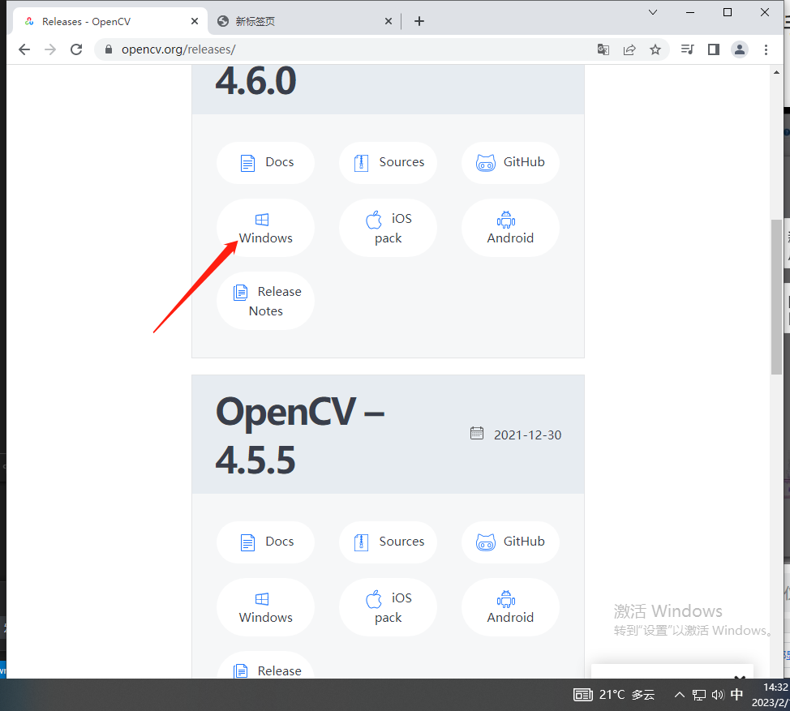
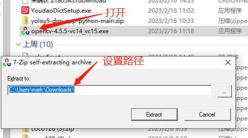
记住这个路径，我的路径是：E:\c++opencv
#### 编辑环境变量
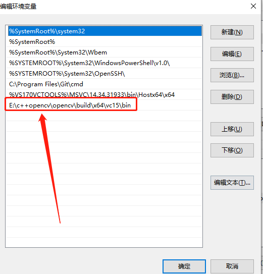

### vs项目配置
打开visual studio2022，首先确保软件中c++桌面开发已安装。  
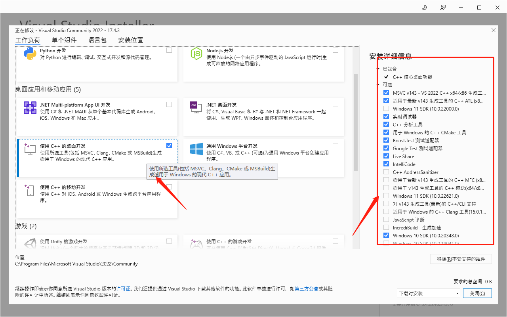
以此点击：创建新项目->空项目->输入项目名称后创建。
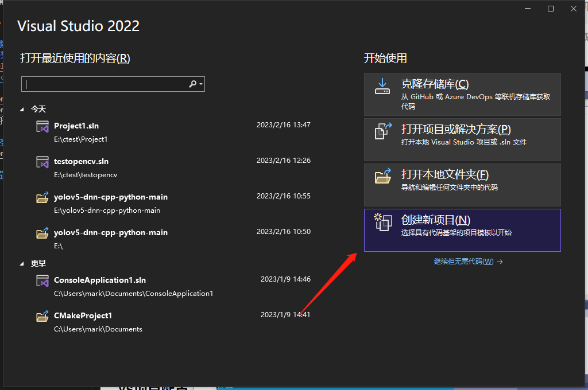
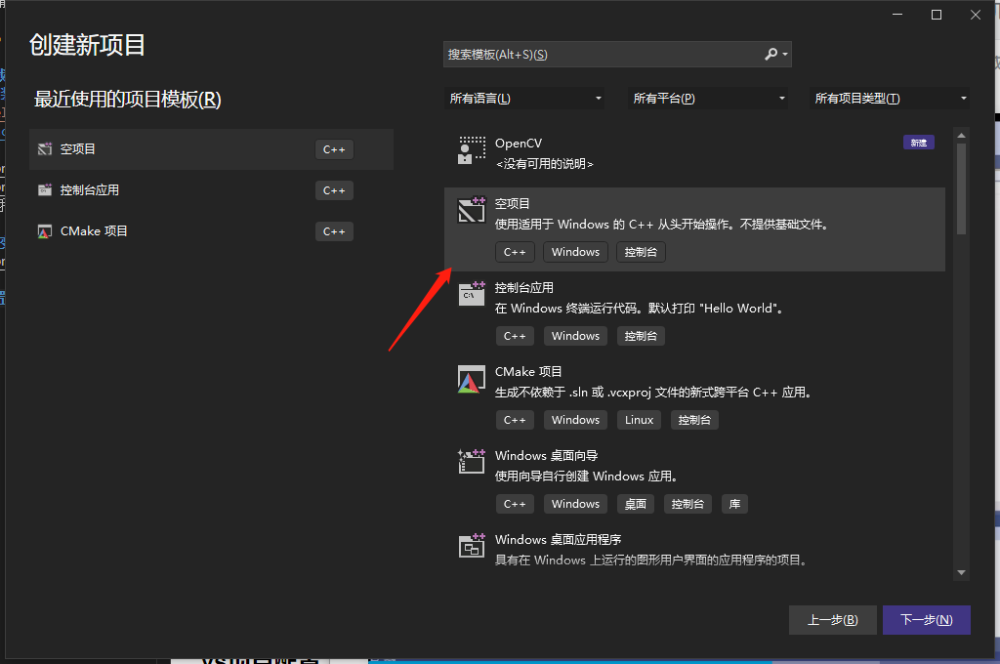
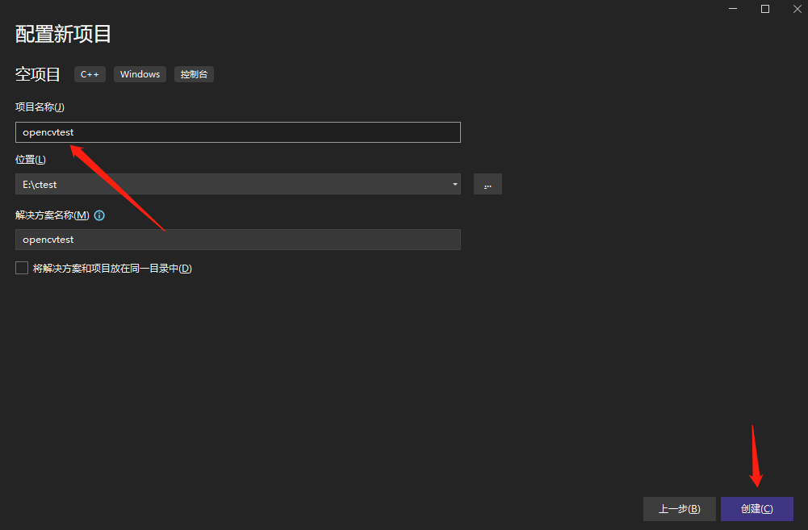
在项目的源文件目录中点添加，新建项中创建test.cpp文件（也可以不）
输入测试代码：
```c
#include <iostream>
#include <opencv2/opencv.hpp>
using namespace cv;
int main() {
	Mat img = imread("C:\\Users\\mark\\Pictures\\test_gray.png");
	namedWindow("mm");
	imshow("mm", img);
	waitKey(6000);
	return 0;
}
```
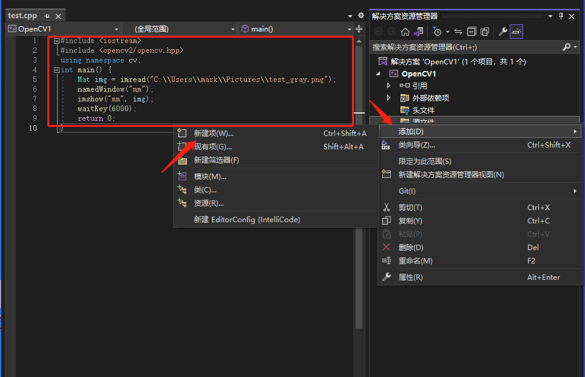
右键项目选择属性  
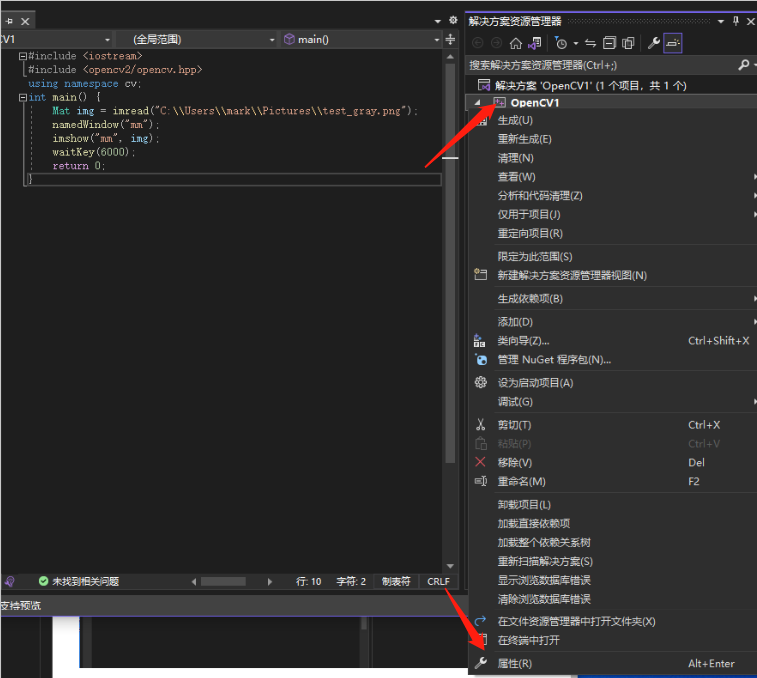
修改包含目录和库目录，包含目录中添加build\include，库目录在build\x64\vc15\lib
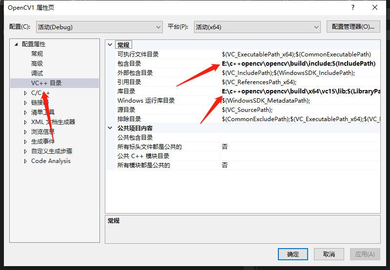
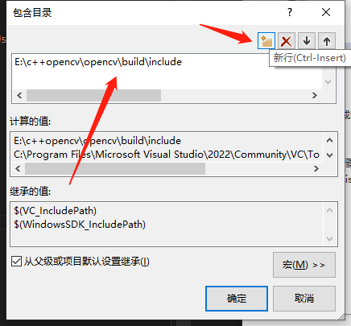
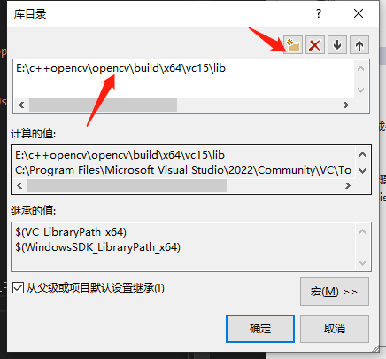
最后还需要配置依赖项，链接器->输入->附加依赖项，输入opencv_world455d.lib。如果是debug模式，则配后面带d的文件，如果是release模式，则配置不带d的文件


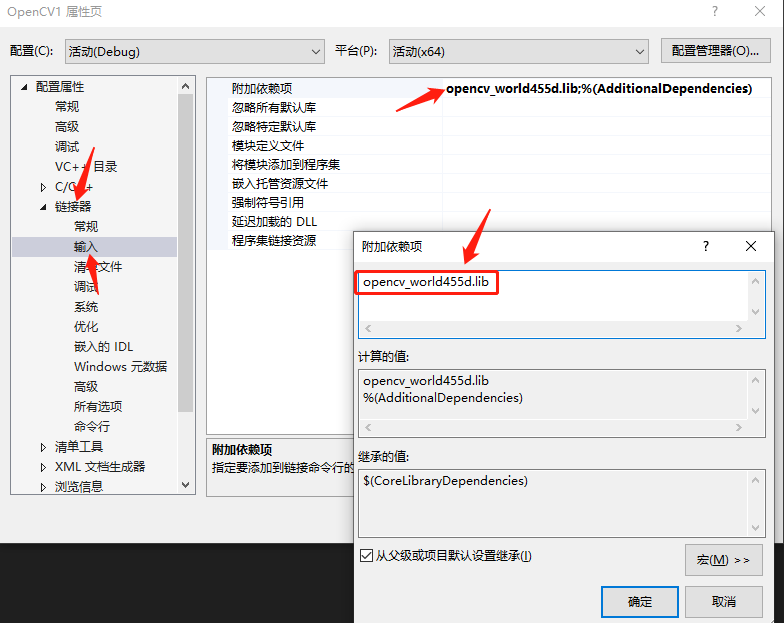
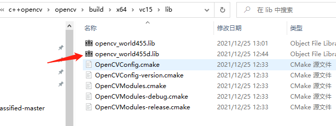

最后运行，成功。
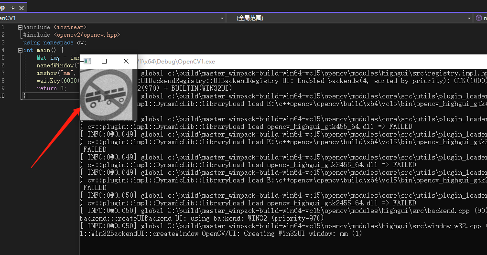

### 导出模板
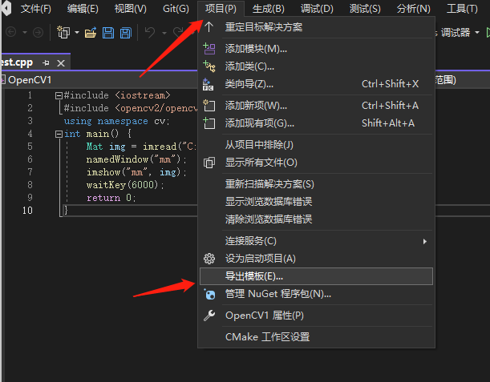
将配置好的opencv导出成模板，以后直接使用模板就可以完成项目创建，避免每次这么麻烦的配置。具体：项目->导出模板。