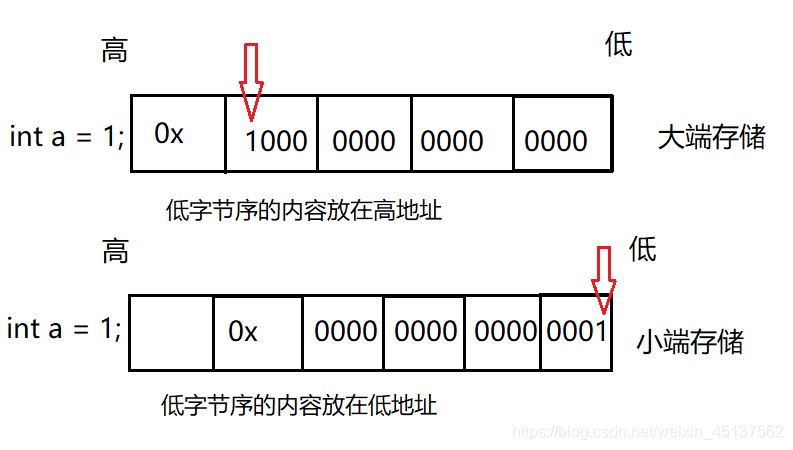

# C 语言大小端

## 什么是大小端

大小端是[内存](https://so.csdn.net/so/search?q=%E5%86%85%E5%AD%98&spm=1001.2101.3001.7020)存储字节的两种方式，一个是大端存储，一个是小端存储。采用大小模式对数据端进行存放的主要区别在于存放的字节顺序，大端方式将高位存放在低地址，小端方式将高位存放在高地址。采用大端方式进行数据存放符合人类的正常思维，而采用小端方式进行数据存放利于计算机处理。

