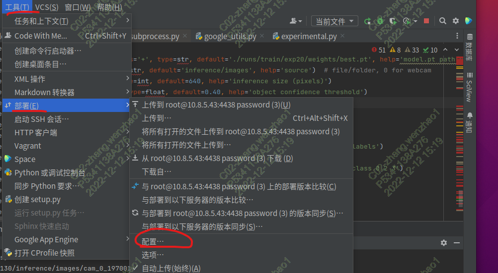
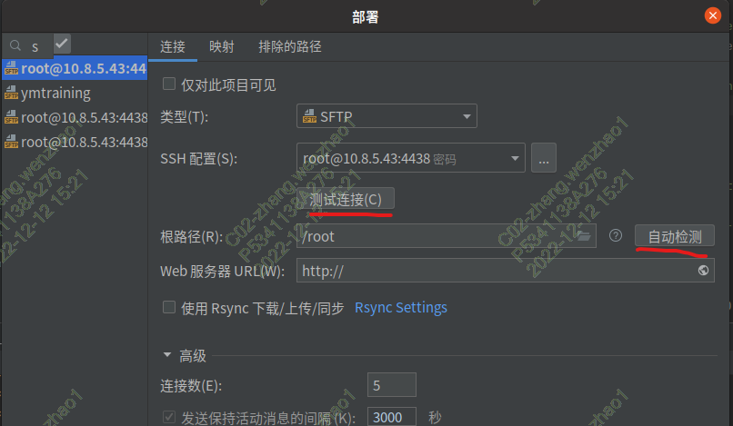
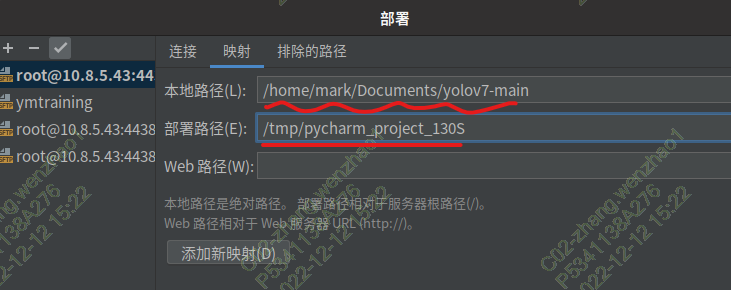
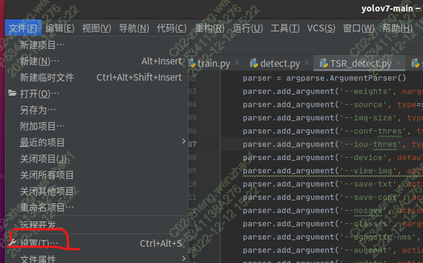
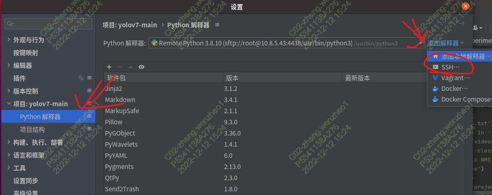
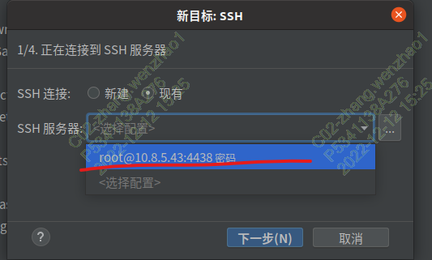
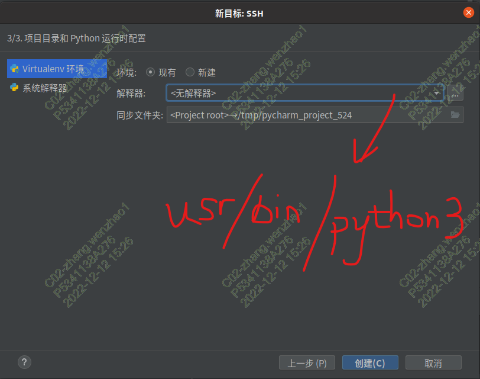

# pycahrm远程连接配置服务器
---

## 注：只有pycharm专业版可以这么操作

项目开发：打开项目
工具 -> 部署 -> 配置

测试连接成功后，设置根目录，可以选择自动检测

设置映射（Mapping）

设置完部署的内容后，设置远程的解释器
文件->设置

选择python interpreter，选择SSH（这里用ssh连接远程服务器所以选择SSH）

选择连接的服务器

远程服务器本身没有网络，所以没必要新建虚拟环境，这里使用现有解释器，路径选择服务器的解释（这里的路径识/usr/bin/python3）

之后直接点击运行，就可以运行python代码进行远程开发了