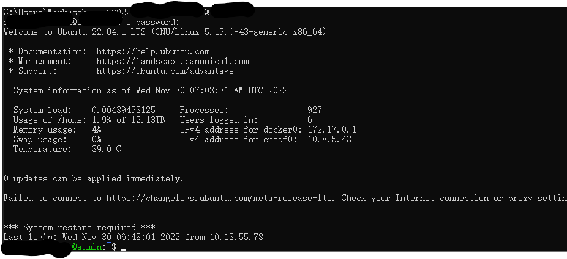
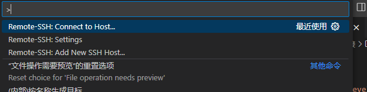

# VScode远程连接
---

参考链接：（知乎）[远程开发初探 - VSCode Remote Development](https://zhuanlan.zhihu.com/p/82568294)

必要：电脑可以ssh，且可以访问到服务器
```bash
ssh -p 端口号 服务器用户名@服务器ip地址
```
大致：  


----
## VScode配置远程连接
安装remote development：  
在vs的插件列表里选择remote development,主要用到其中Remote-SSH插件。  
按ctrl + shift +p后，出现  
  
选择remote-ssh connect to host  
选择 “+Add New SSH Host...”，输入
```bash
ssh -p 端口号 服务器用户名@服务器ip地址
```
后生成一个服务器连接，点进去则可以连接成功。

----
## 配置SSHkey
打开命令栏，依次输入
```bash
cd %USERPROFILE%/.ssh
ssh-keygen -t rsa -b 4096
你的密钥文件名(这里用id_rsa.pub)
设置密钥密码（俩回车为无密码）
```
之后\users\用户名\\.ssh文件里会出现id_rsa和id_rsa.pub文件，然后依次输入指令
```bash
SET REMOTEHOST=服务器用户名@服务器ip地址

scp %USERPROFILE%\.ssh\id_rsa.pub %REMOTEHOST%:~/tmp.pub
ssh %REMOTEHOST% "mkdir -p ~/.ssh && chmod 700 ~/.ssh && cat ~/tmp.pub >> ~/.ssh/authorized_keys && chmod 600 ~/.ssh/authorized_keys && rm -f ~/tmp.pub"
```
解释下上面的操作：在远程服务器创建一个```.ssh/authorized_keys```文件，在这个文件里将生成的id_rsa.pub文件中的公钥复制进去。
最后，修改本地的```./.ssh/config```修改后：
```bash
# Read more about SSH config files: https://linux.die.net/man/5/ssh_config
Host 10.*.*.*
    HostName 10.*.*.*
    Port *
    User *
    IdentityFile ~/.ssh/isa_rsa
```
再运行ssh，就可以连接到远程服务器了（用自己的公钥）

之前遇到过scp指令会提示无法连接ip地址和port：22的问题（实际场景中的端口不是22），则在scp中加入-p 60022