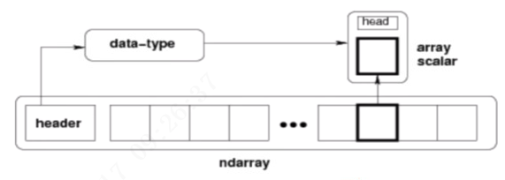

ndarray存放同类型元素的数组  
ndarray在内存中都有相同存储大小的区域  
组成：

* 一个指向数据的指针
* 数据类型或dtype，描述在数组中的固定大小值得格子
* 一个表示数组形状(shape)的元组，表示各维度大小的元组
* 一个跨度元组(stride)

## 数据类型
|数据类型名|解释|
|-|-|
|bool|布尔类型|
|int|默认|
|int8|[-128,127]|
|uint8|[0,255]|
|int16|[-32768,32767]|
|uint16|[0,65535]|
|int32、uint32、int64、uint64||
|float16|一个符号位，五个指数位，10个尾数位|
|complex64|复数，表示双32位浮点数|

数据类型dtype