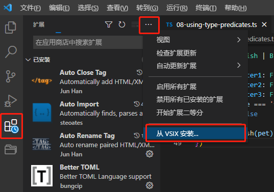

# VScode在离线电脑上安装插件
---  
在vscode官网[https://marketplace.visualstudio.com/vscode](https://marketplace.visualstudio.com/vscode)搜索需要使用的插件名称，下载VSIX文件  

在离线的vscode中，左侧extension安装VSIX，选中下载好的VSIX后安装

问题：如果出现*Unable to install extension ‘dart-code.flutter’ as it is not compatible with VS Code ‘1.51.1’.*  
将vsix包尾缀改成.zip，解压出来后找到package.json文件，在文件中将engines下，vscode版本修改成使用的vscode的版本，之后再将所有文件弄成.vsix文件。  
vscode版本在上边 帮助 --> 关于 中查看。