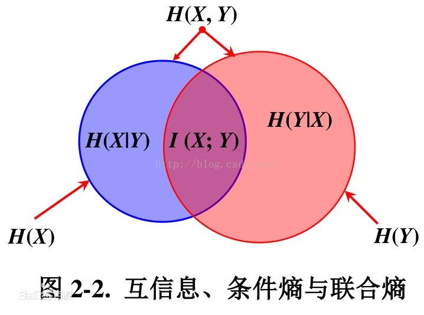

## 条件熵
条件熵H(X|Y)表示在已知随机变量Y的条件下，随机变量X的不确定性。

H(X|Y)定义为在给定条件Y下，X的条件概率分布的熵对Y的数学期望：

$$H(X|Y) = \sum_y p(y)H(X|Y=y)\\
=-\sum_y p(y)\sum_x p(x|y) \log(p(x|y))\\
=-\sum_y\sum_x p(x,y) \log(p(x|y))\\
=-\sum_{x,y}p(x,y)\log(p(x|y))
$$
连续形态：
$H(Y|X) = -\int P(X,Y)\log P(Y|X)\text{d}X$

联合概率信息熵
$$ H(X,Y) = \sum_{x\in X}\sum_{y\in v} \log p(x,y) $$
连续形态：
$$ H(X,Y) = -\int P(X, Y)\log P(X, Y) \text{d}X\text{d}Y $$

信息熵
$$H(X) = -\int P(X) \log P(X)\text{d}X$$

条件熵、信息熵、熵关系 
$H(Y|X) = H(Y,X)-H(X)$