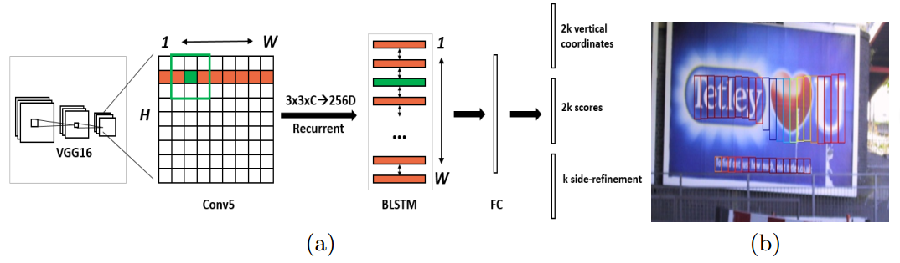
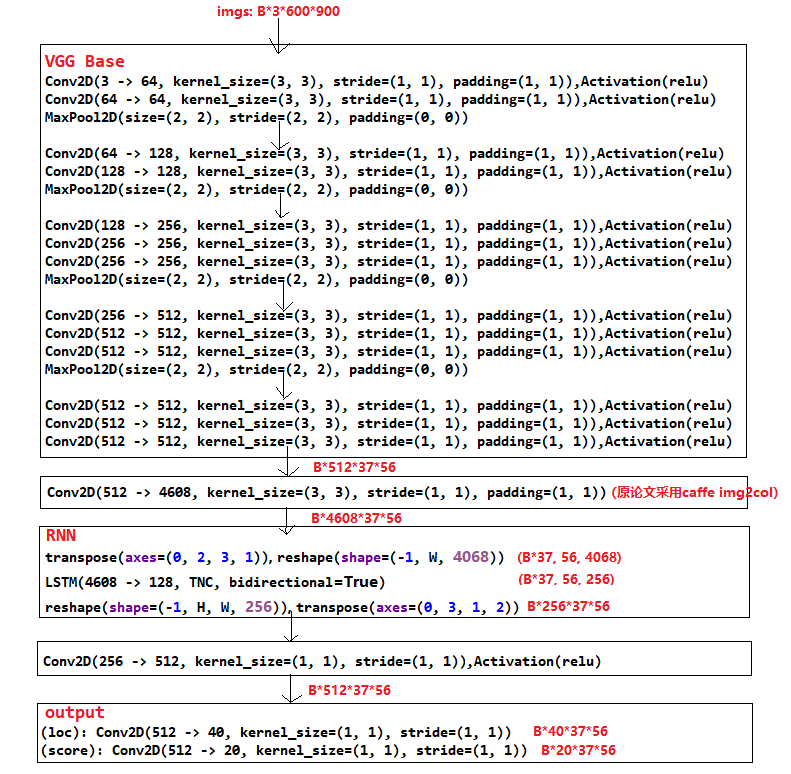

# 文本检测网络 CTPN

CTPN网络，全称为Connectionist Text Proposal Network，常应用于OCR任务中。文本检测任务更注重于检测出文本内容的边界，因此相较于一些通用的目标检测模型，例如Faster RCNN、YOLO，CTPN的anchor更为特殊，且将图像经reshape后输入至RNN网络中，下面将介绍该算法。

## 目录
1. 文本检测
2. CTPN模型
3. CTPN网络结构图
4. 损失函数
5. 参考

---
## 1. 文本检测  
OCR（光学字符识别）是CV一个重要的研究领域，OCR分成文本检测和文本识别两个步骤，其中文本准确检测的困难性又是OCR中最难的一环，而本文介绍的CTPN则是文本检测中的一个里程碑的模型。  
文本检测有别于一般的目标检测，区别有以下几种：  
（1）  一般的目标检测的每个目标一般是孤立的，所以每个目标的边界框都很明确，而对于文本检测中边界其实没有那么容易界定，因为文本（单词）其实是一个序列，在图像中每个单词中间是有空格的（字母间），对于我们的算法就很难界定这是单词内空格还是单词间空格，这也就分不清我们要检测文本的开始与结束的地方。  
（2）  文本是一个序列，除去空间特征它还具有很重要的序列特征，它的上下文的序列信息对我们检测文本是有帮助的，而传统的目标检测提取的都是空间特征，自然效果不好。  
（3）文本行的长度变化是不固定而且变化很大，使用通用的检测算法很难生成好的候选框text proposal。

---
## 2. CTPN模型
  
上图展示了CTPN模型的基本网络结构，下面阐述CTPN的算法流程。  
(1) 首先使用VGG16作为backbone提取特征,得到B × W × H × C的feature map。  
(2) 将上一步的feature map经过一个卷积层来提取特征，得到的feature map为B × W × H × 9C。  
(3) feature map 经过reshape后变成 (NH) × W × 9C, 输入BiLSTM(原文中BLSTM)，输出(NH) × W × 256,最后reshape成N × 256 × H × W。  
注：这一步中的N是图像数量,实际上还是等于B，理解一下这里为什么要reshape成NH，因为实际预测的文字顺序是横着的，这样reshape的话，自然也就无法识别竖直文字了。  
(4) 经过FC层变成N × H × W × 512。  
注：这里说是FC层，但实际上还是一个卷积。  
(5) 上一步输出的N × H × W × 512会变成三个预测支路，第一个分支输出的是anchor的位置（vertical coordinates）；第二个分支输出得分情况（scores）；第三个分支输出水平修正后的比例（side-refinement），可以参考下RCNN的RPN结构。  
（6）模型后处理阶段，使用NMS过滤多余文本框，再通过所有anchor中心点，矫正文本行。  

---
## 3. CTPN结构
模型的网络结构基本如下图，这里参考原作者代码版本。

---
## 4. 损失函数
CTPN中的loss包括了三部分的loss
* 文本区域的分类损失cls_loss
* box的中心点x和高度损失vertical_loss
* box两侧的偏差损失side_refinment_loss。
分类损失采用交叉熵，box回归损失采用smoothL1。  
将三块内容整合后，CTPN的损失函数如下。  
$$L(s_i,v_j,o_k)=\frac{1}{N_s}\sum_i{L_s^{cl}(s_i,s_i^*)}+\frac{\lambda_1}{N_v}\sum_j{L_v^{re}(v_j,v_j^*)}+\frac{\lambda_2}{N_o}\sum_k{L_o^{re}(o_k,o_k^*)}$$  
式中S为anchor的分类loss，V是中心y坐标和高度loss，O是box两侧偏差loss，N是归一化系数，$\lambda$是权重系数。

---
## 5. 参考
1. [Detecting Text in Natural Image with
Connectionist Text Proposal Network](https://arxiv.org/abs/1609.03605)
2. [文本检测网络CTPN](https://www.cnblogs.com/silence-cho/p/14011231.html)
3. [深度解析文本检测网络CTPN](https://zhuanlan.zhihu.com/p/137540923)
4. [OCR之CTPN](https://zhuanlan.zhihu.com/p/43145228)