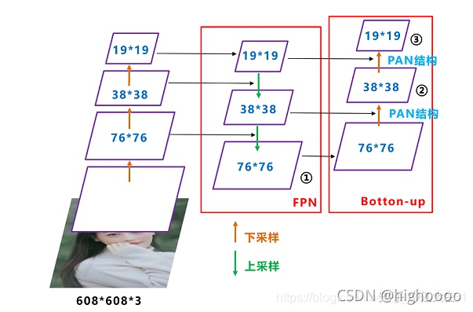

# SPP

## SPP的应用的背景
在卷积神经网络中我们经常看到固定输入的设计，但是如果我们输入的不能是固定尺寸的该怎么办呢？

通常来说，我们有以下几种方法：

1. 对输入进行resize操作，让他们统统变成你设计的层的输入规格那样。但是这样过于暴力直接，可能会丢失很多信息或者多出很多不该有的信息（图片变形等），影响最终的结果。

2. spp

## FPN+PAN  

FPN 高维度向低维度传递语义信息（大目标更明确）  

PAN 低维度向高维度再传递一次语义信息（小目标也更明确）  

