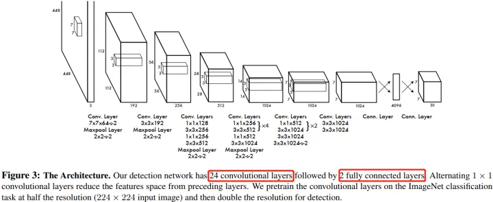
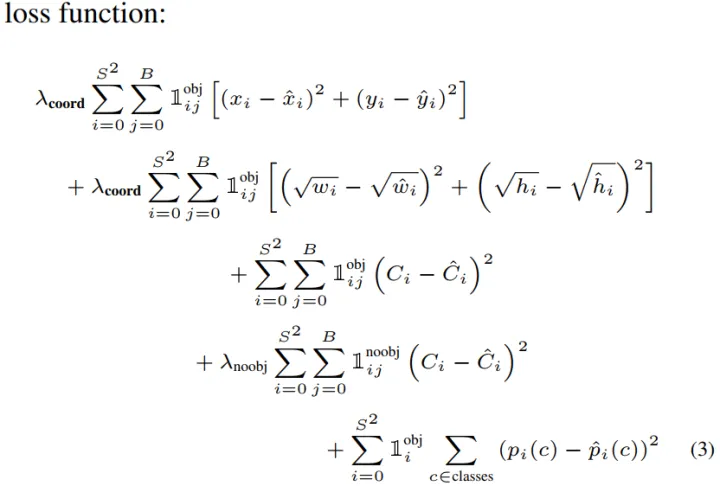
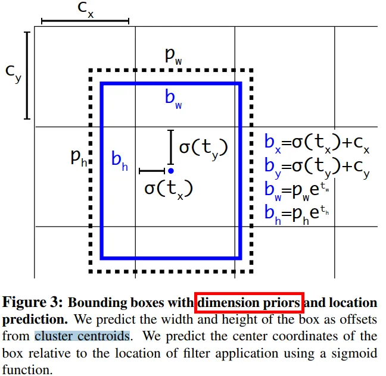
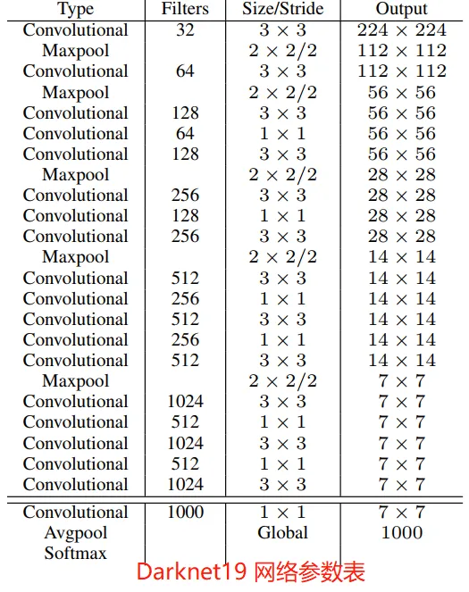
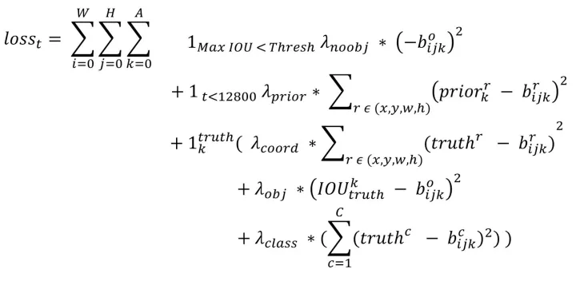
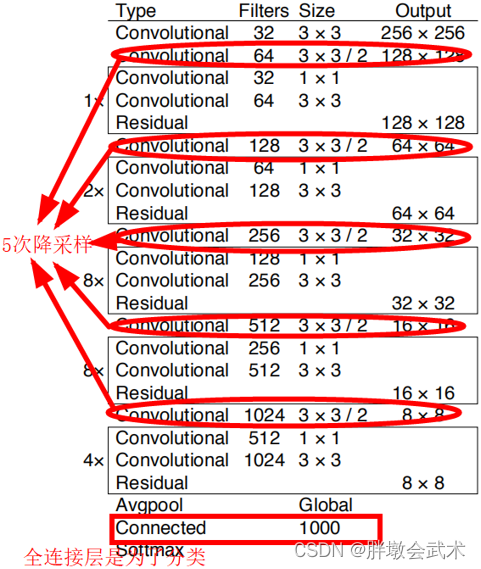
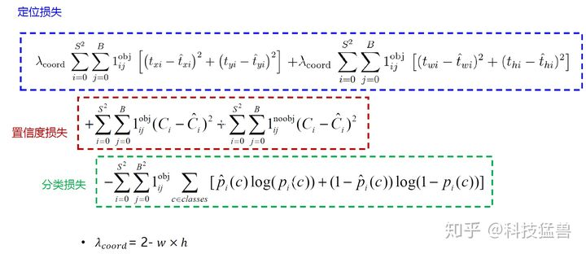
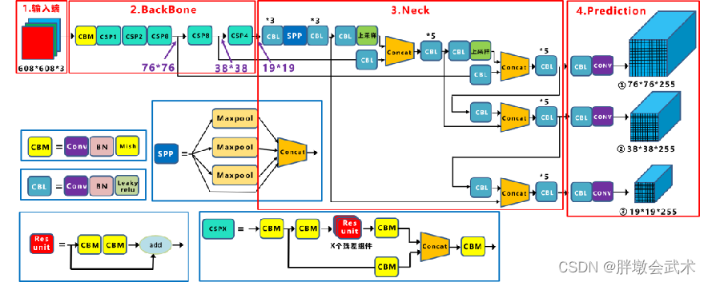
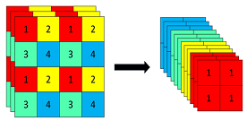

# YOLO系列
参考：[yolov1-v5](https://zhuanlan.zhihu.com/p/562970595?utm_id=0)
目录
-- yolov1
-- yolov2

## YOLO系列核心思想：
* 将输入的图像经过backbone提取特征后，将得到特征图划分为SxS的网格，物体的中心落在哪一个网格内，这个网格就负责预测该物体的**置信度、类别以及坐标位置**

----
## yolov1

出自2016年CVPR you only look once:Unified, Real-Time Object Detection
### yolov1核心思想：

S是网格的数目，B是网格生成的grid数目(默认为2)，C是类别数（C个类别的概率），最后模型的预测张量维度是SxSx(B*5+c)

### network design
（图片输入：448*448）  

YOLO 的网络架构受 GooLeNet 图像分类模型的启发。网络有 24 个卷积层，最后面是 2 个全连接层。整个网络的卷积只有 和  卷积层，其中  卷积负责降维 ，而不是 GoogLeNet 的 Inception 模块。

### 训练
    训练的核心就是超参数调整以及损失函数设计。

yolo:检测问题->回归问题，损失函数：均方误差
引入两个参数：
 * $\lambda_{coord} = 5$，定位误差-->边界框坐标预测损失
 * $\lambda_{noobj} = 0.5$，区分不包含目标的边界框和含有目标的边界框，前者采用$\lambda_{noobj}=0.5（降低负样本预测权重）$

#### Q：为什么w，h使用$\sqrt w,\sqrt h$去预测？
对于大小不同的边界框因为较小边界框的误差比较大边界框要更敏感，所以为了解决这一部分的问题，网络边界框宽高预测改为平方根的预测，预测值变为$(x,y,\sqrt w, \sqrt h)$

##### 
yolo中每个网格单元预测多个边界框，训练时每个目标只需要用一个边界框预测器来负责，指定一个预测器“负责”根据哪个预测与真实值之间具有当前最高的IOU来预测目标，每个预测器可以更好的预测特定大小、方向角或者目标的类别，从而改善整体召回率。

loss function

这里x，y是基于grid的偏移
其中$I_{ij}^{obj}是第i个单元格存在目标，单元格中第j个边界框负责预测该目标，$I_{i}^{obj}$是第i个单元格存在目标

##### 推理时采用NMS抑制多重检测

-----------

### yolov2
yolov2是CVPR2017年最佳，yolov2 = yolo9000

#### yolov2的改进：

1. 中心坐标位置预测的改进
    yoloV1模型是边界框中心目标（x,y）是基于grid的偏移

*边界框的编码流程*：yolov2参考了两阶段网络的anchor box预测边界框相对先验框的偏移，沿用边界框中心点相对grid左上角位置的相对偏移值。
(x,y,w,h)的偏移值和实际坐标修改为：

其中：
* $b_x , b_y ,b_w, b_h$:模型预测后的box中心坐标和宽高
* $t_x , t_y ,t_w, t_h$:模型预测的偏移量
* $c_x , c_y$:grid（网格）左上角的坐标
* $p_w , p_h$：预设的anchor框的宽高（人为设定）

2. 增加查全率，
    1. 把7*7的区域(grid)改成13\*13
每个区域有5个anchor，一个anchor对应一个类别，输出的尺寸[N, 13, 13, 125]

    2. yolov1 :一个grid只能搜索一个目标
yolov2改进：一个grid内的anchor可以对应一个目标，有一个单独的目标分类值

3. backbone改进
提出了一个全新的backbone网络：darknet-19，和VGG类似，使用3x3卷积
网络结构：

4. 多尺度训练
目的：增强模型的鲁棒性
因为 YOLOv2 模型中只有卷积层和池化层，所以YOLOv2的输入可以不限于416x416 
 大小的图片。引入了多尺度训练(multi-scale)可以在不同尺寸的图片上运行，输入图像必须是32的倍数（对齐yolov2下采样值）。最小输入图像为320*320，特征图大小10*10，最大输入图像608*608，特征图19*19，每隔10个iterations随机选择一种输入图片大小，需要修最后的检测头适应维度变化后，可以重新训练。
#### yolov2损失：

其中t是迭代次数。

## yolov3

### 改进

1. 主要针对小目标检测进行改进
网络预测的组后进行上采样+拼接
2. 多标签分类：softmax改成logistic()

backbone：Darknet-53

损失变了,分类损失改成交叉熵损失

## yolov4

### 改进
1. 加权残差链接(WRC)
2. 跨阶段部分连接(CSP)
3. 跨 小批量标准化(CmBN)
4. 自对抗训练（SAT）
5. Mish激活
6. 马赛克增强
7. DropBlock正则化
8. CIoU Loss

backbone: CSPDarknet53

主要区别：
1. 将Darknet53与CSP结合
2. 采用SPPNet适应不同尺寸输入大小，增大感受野
3. 采用SAM引入空间注意力机制
4. 采用FPN、PAN
5. 激活函数由Mish替换Leaky ReLU

## yolov5

### 改进
其实跟yolov4一样，一个工程实现
1. 自适应anchor
2. 自适应图片缩放
3. Focus结构
