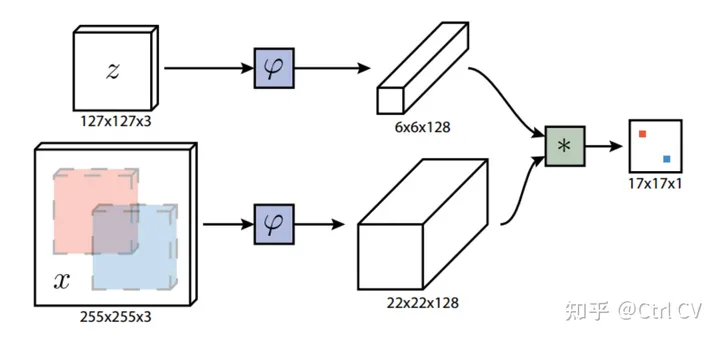
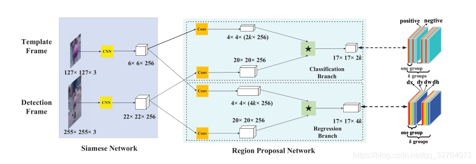

### 单目标跟踪->SiamFC算法

网络结构包括两个输出，一个为基准，一个为要选择的候选样本，目标跟踪任务基准选择是第一帧目标图像，整个过程如下：
1. 首先选择第一帧的目标z（groundtruth中有标记）,大小为127 x 127 x3；
2. 选择第二帧的整个图像作为搜索区域x, 大小为 255 x 255 x 3; 
3. 分别将两幅图片输入到所设计的网络$\phi$中（作者使用的Alexnet），提取两幅图片分别的特征，形成feature map。大小分别为 6 x 6 x 128和 22 x 22 x 128;  
4. 计算两个特征图的互相关性，大小为17 x 17 x 1，进行 * 操作，找到其余帧中与第一帧中相关性最大的目标。

### 单目标跟踪-> siamRPN
由于SiamFC网络只能确定目标中心点的位置，无法改变bbox大小，且SiamFC是通过构建金字塔的方式去应对目标尺度发生改变的情况，这种做法不仅计算量大而且得到的目标位置不够精确，在SiamRPN中，作者将目标检测领域的Faster R-CNN论文中提出的RPN应用到目标追踪领域，对目标位置进行回归得到更加精确的目标位置。

图中siameseNet可以为AlexNet，之后经过一个cnn网络后进行互相关计算图中\*，\* 可以看成使用4x4的卷积核对20x20x256进行卷积计算，最后正好变成17x17

损失有两部分：交叉熵损失：用作分类；smoothL1 LOSS用作回归

### one-shot detection
首先siamese NET是一个few-shot learning模型，在这里实际使用其few-shot learning的特性做one-shot detection。
1. 输入模板帧和检测帧，分别使用siamese提取特征，使用RPN生成k个proposal（k是anchor的数量，本文是5）

2. 对模板分支的proposal和检测分支的proposal做相似性度量，获得bounding box

3. 使用NMS对最后预测输出的bounding box进行筛选

4. 目标尺寸更新（使用线性插值的方法）

#### proposal选择策略：

1. 丢弃远离中心的proposal（认为相邻帧的目标位置不会发生很大的变化，而模板帧的目标是在中间的）

2. 使用余弦窗和尺度变化惩罚因子对proposal进行重新排序（余弦窗和尺度变化惩罚因子是沿用了SiamFC的做法）

3. 使用NMS对最后预测输出的bounding box进行筛选。

reference：
1. https://www.jianshu.com/p/a3786b61031c