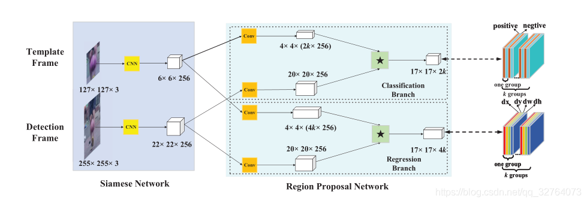

# 目标跟踪调研报告

## 目标跟踪任务

在目标跟踪领域，SOT、VOS、MOT和MOTS是不同的任务或方法，它们有各自的特点和应用领域。

* **SOT（Single Object Tracking，单目标跟踪）**
    SOT任务旨在跟踪视频序列中的单个目标，通常是在目标的初始帧中提供一个边界框，并在后续帧中估计目标的位置。
    SOT方法关注的是单个目标的连续性和准确性，通常不需要处理多个目标。
    典型的SOT方法包括基于视觉特征的跟踪算法，例如相关滤波器跟踪器或深度学习方法。

* **VOS（Video Object Segmentation，视频目标分割）**
    VOS任务旨在在视频序列中对目标进行像素级别的分割，而不仅仅是边界框跟踪。它要求在每个帧中提供目标的完整分割掩码。
    VOS方法通常需要处理每个帧中的遮挡、姿态变化和背景干扰等复杂情况。
    VOS方法通常使用深度学习技术，如卷积神经网络（CNN），以生成目标分割掩码。
* **MOT（Multiple Object Tracking，多目标跟踪）**
    MOT任务涉及同时跟踪视频序列中的多个目标，通常涉及在不同帧之间关联目标以维护其身份。
    MOT方法需要解决多目标之间的相互遮挡、交叉和分离等问题，以准确跟踪它们的轨迹。
    MOT通常使用多目标跟踪器和数据关联算法，例如卡尔曼滤波器、多假设跟踪等。
* **MOTS（Multiple Object Tracking and Segmentation，多目标跟踪和分割）**
    MOTS任务结合了多目标跟踪和VOS任务的元素，旨在在视频中同时跟踪多个目标并提供它们的像素级别分割。
    MOTS方法需要解决多目标的连续跟踪和分割之间的一致性问题，通常涉及跟踪器和分割网络的结合。
    这一领域的研究通常使用深度学习技术，例如联合训练跟踪器和分割网络，以实现目标的同时跟踪和分割。

* 对比一下SOT、VOS、MOT、MOTS四个模型在输入上的的区别。

* 下图主要展示了SOT&VOS对比MOT和MOTS的区别
    * 被跟踪对象的特征各不相同
    * SOT和MOT任务需要不同类型的特征输入(SOT特征是像素级(pix-level)的,而MOT特征是实例级(instance-level)的)
    * 输入特征不一样(SOT可以输入小的搜索区域图,而MOT需要输入完整且高清的检测图)

接下来具体说明几个具体领域下的目标跟踪算法
## SOT
在单目标跟踪任务中，系统需要从一个视频序列中选择一个感兴趣的目标，并在随后的帧中保持该目标的连续跟踪。通常，任务的开始是在目标的初始帧中手动标定目标的边界框，然后跟踪算法根据目标的运动和外观变化来估计目标在后续帧中的位置。

### 单目标跟踪->SiamFC算法

网络结构包括两个输出，一个为基准，一个为要选择的候选样本，目标跟踪任务基准选择是第一帧目标图像，整个过程如下：
1. 首先选择第一帧的目标z（groundtruth中有标记）,大小为127 x 127 x3；
2. 选择第二帧的整个图像作为搜索区域x, 大小为 255 x 255 x 3; 
3. 分别将两幅图片输入到所设计的网络$\phi$中（作者使用的Alexnet），提取两幅图片分别的特征，形成feature map。大小分别为 6 x 6 x 128和 22 x 22 x 128;  
4. 计算两个特征图的互相关性，大小为17 x 17 x 1，进行 * 操作，找到其余帧中与第一帧中相关性最大的目标。

### 单目标跟踪-> siamRPN
由于SiamFC网络只能确定目标中心点的位置，无法改变bbox大小，且SiamFC是通过构建金字塔的方式去应对目标尺度发生改变的情况，这种做法不仅计算量大而且得到的目标位置不够精确，在SiamRPN中，作者将目标检测领域的Faster R-CNN论文中提出的RPN应用到目标追踪领域，对目标位置进行回归得到更加精确的目标位置。

图中siameseNet可以为AlexNet，之后经过一个cnn网络后进行互相关计算图中\*，\* 可以看成使用4x4的卷积核对20x20x256进行卷积计算，最后正好变成17x17

siamRPN损失有两部分：交叉熵损失：用作分类；smoothL1 LOSS用作回归

#### 模型对比数据
SOT任务中siamRPN和siamFC在voc2015测试集上的表现。

## MOT

  多目标跟踪，一般简称为MOT(Multiple Object Tracking)，也有一些文献称作MTT(Multiple Target Tracking)。在事先不知道目标数量的情况下，对视频中的行人、汽车、动物等多个目标进行检测并赋予ID进行轨迹跟踪。不同的目标拥有不同的ID，以便实现后续的轨迹预测、精准查找等工作。

  MOT是计算机视觉领域的一项关键技术，在自动驾驶、智能监控、行为识别等方向应用广泛。如下图所示，对于输入视频，输出目标的跟踪结果，包括目标包围框和对应的ID编号。理论上，同一个目标的ID编号保持不变。  
  多目标跟踪中即要面对在单目标跟踪中存在的遮挡、变形、运动模糊、拥挤场景、快速运动、光照变化、尺度变化等挑战，还要面对如轨迹的初始化与终止、相似目标间的相互干扰等复杂问题。因此，多目标跟踪当前仍然是图像处理中的一个极具挑战性的方向，吸引了不少研究人员的长期投入。
  在多目标跟踪领域，常用的跟踪策略是TBD（Tracking-by-Detection，主流）和DFT(Detection-Free Tracking)。TBD，也可叫DBT（Detection-Based-Tracking）。即在每一帧进行目标检测，再利用目标检测的结果来进行目标跟踪，这一步我们一般称之为数据关联（Data Assoiation）。  
  MOT 获取单个连续视频并以特定帧速率 (fps) 将其拆分为离散帧以输出。

### 挑战
目标跟踪是一个早已存在的方向，但之前的研究主要集中于单目标跟踪，直到近几年，多目标跟踪才得到研究者的密切关注。与其它计算机视觉任务相比，多目标跟踪任务主要存在以下研究难点：

准确的对象检测的问题是未能检测到对象或者为检测到的对象分配错误的类别标签或错误地定位已识别的对象：

* ID Switching发生在两个相似的物体重叠或混合时，导致身份切换；因此，很难跟踪对象 ID。

* 背景失真：复杂的背景使得在物体检测过程中难以检测到小物体

* 遮挡：对象被另一个对象隐藏或遮挡时会产生这个问题。

* 多个空间空间、变形或对象旋转

* 由于运动模糊而在相机上捕获的视觉条纹或拖尾

好的MOT算法特点：
* 通过在每帧的精确位置识别正确数量的跟踪器来跟踪对象。

* 通过长期一致地跟踪单个对象来识别对象，

* 尽管有遮挡、照明变化、背景、运动模糊等，仍可跟踪对象。

* 快速检测和跟踪物体

MOT方法：
1. tracking by detection 检测器和匹配机制 --sort、deepsort、strongsort
2. joint detection and tracking -一个模型可以同时完成检测和匹配 --JDE、FairMOT、CenterTrack、QDTrack
3. Tracking by Attention -- TrackFormer、GTR

### bytetrack
基于多目标跟踪中的tracking-by-detection范式,bytetrack算法思想大致如下:
1. BYTE 会将每个检测框根据得分分成两类，高分框和低分框，总共进行两次匹配。
2. 第一次使用高分框和之前的跟踪轨迹进行匹配。
3. 第二次使用低分框和第一次没有匹配上高分框的跟踪轨迹（例如在当前帧受到严重遮挡导致得分下降的物体）进行匹配。
4. 对于没有匹配上跟踪轨迹，得分又足够高的检测框，我们对其新建一个跟踪轨迹。对于没有匹配上检测框的跟踪轨迹，我们会保留 30 帧，在其再次出现时再进行匹配。

#### 模型对比数据
bytetrack模型有较高的运行效率，同时具有目前性能较高的mota评分。

### unicorn
模型目标:将所有跟踪任务进行结合：SOT、VOS、MOT、MOTS

模型特点：统一的输入和backbone、统一的embedding、统一的head

输入：高分辨率参考帧和当前帧作为输入
backbone：ConvNeXt

$ E_{ref} \in R^{hw\times c} $
$ E_{cur} \in R^{hw\times c} $
$ C_{pix} = softmax(E_{cur}E_{ref}^T) $
其中$C_{pix}$是hw x hw的矩阵，含义是给一个frameA的点，得到最相似的frameB的点。

对于MOT和MOTS，实例级embedding e从embeddingE中提取，M个轨迹，N个检测结果
$e_{ref}\in R^{M\times c}, c_{cur}\in R ^{N\times c} \rightarrow C_{inst} =softmax(e_{cur}e_{ref}^T) \rightarrow C_{inst}\in R^{N\times M}\rightarrow C_{inst} \text{is the sub-matrix of }C_{pix}$

论文中i模块（interaction）使用了deformable attention block，两倍上采样$ E_{ref},E_{cur} = Upsample(Attention(F_{ref},F_{cur})) $

设计统一的loss function来训练embedding
dice loss和crossEntropy

关于G矩阵：关于NxM的矩阵,两个同属于一个id的位置处值为1，否则为0，使用交叉熵损失。

#### 检测的头部
使用了target prior作为具体的头部输入（通过embedding输出的targetprior和远视特征进行一个融合fusion（图中的圈F）
头部结构拆解：
采用了YOLOX的头部结构

训练：
两阶段训练,首先训练SOT和MOT任务,其次训练VOS和MOTS任务的mask

#### 模型对比数据
单目标跟踪SOT任务，在LaSOT和TrackingNet上的评分。

多目标跟踪MOT任务，在MOT17上的评分。

## 数据集统计

| 数据集名称         | 数据集描述                                       | 数据集链接                                             |
|------------------|-----------------------------------|---------------------------------------------------|
| MOT (Multiple Object Tracking) | 包含多个目标的视频序列，通常用于MOT任务的评估。 | [MOT Challenge](https://motchallenge.net/)     |
| VOT (Visual Object Tracking) | 包含多个视觉目标跟踪数据集，用于SOT评估。    | [VOT Challenge](http://www.votchallenge.net/) |
| OTB (Object Tracking Benchmark) | 提供多个目标跟踪数据集，涵盖不同场景和挑战。 | [OTB Benchmark](https://cvlab.hanyang.ac.kr/tracker_benchmark/index_v1.html) |
| LaSOT (Large-Scale Single Object Tracking) | 大规模单目标跟踪数据集，涵盖大量不同类型的目标。 | [LaSOT Dataset](https://cis.temple.edu/lasot/) |
| COCO (Common Objects in Context) | 一个通用的计算机视觉数据集，包括目标检测和分割任务。 | [COCO Dataset](https://cocodataset.org/) |
|TrackingNet|描述：TrackingNet是一个大规模的SOT数据集，包含超过500个视频序列，用于评估各种SOT算法的性能。|[TrackingNet Dataset](https://trackingnet.org/)|
