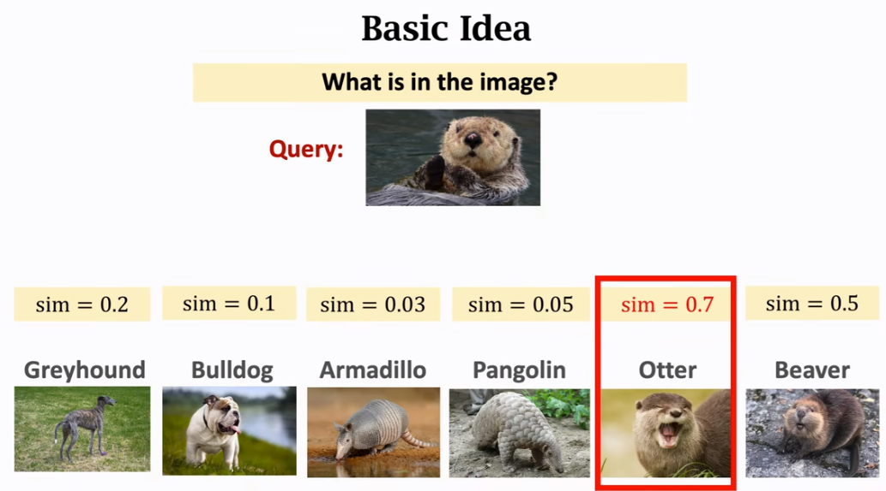
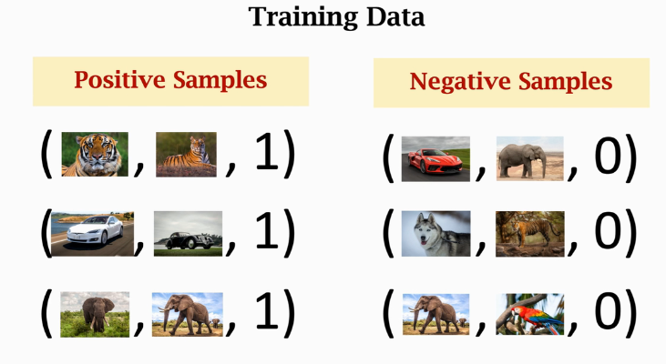
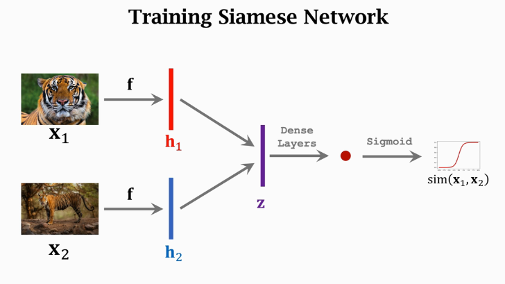
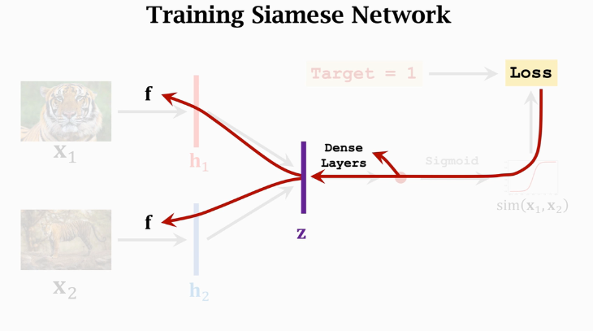
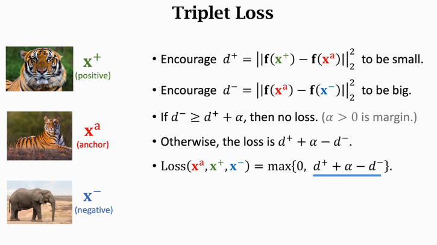
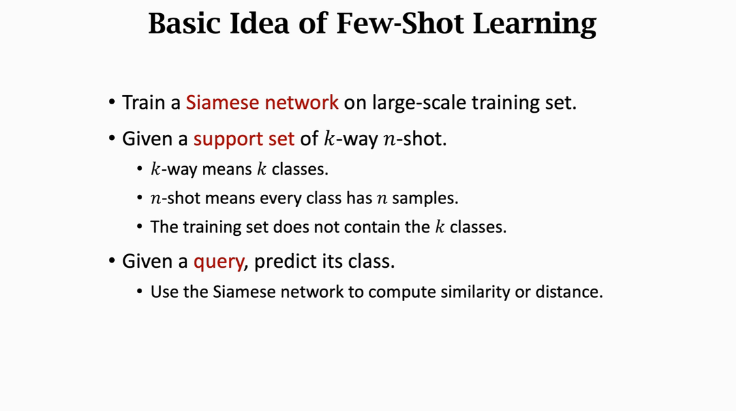
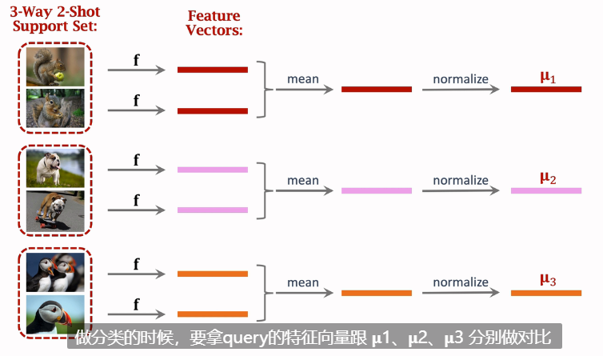

# 元学习(Meta Learning)
元学习解决机器学习自己学习的问题

## 少样本学习 few-shot learning
Few-shot learning is a kind of meta learning.
Meta learning: learn to learn.
元学习这个概念很虚，少样本学习可以认作为元学习的一种

### few-shot learning 中部分概念
support set：带标签的图片为support set，相比train set而言很小，其数据难以做一个神经网络  

k-way: the support set has *k* classes.  

n-shot: every class has *n* samples. e.g:one-shot，那里面只有一个图片

Query：可以理解为待查询类别的图片

一般方法：训练一个函数f，计算两个图片$x_1，x_2$的相似度$sim(x_1, x_2)$。
具体操作看下面的那个图。计算出sim就可以softmax了
  
元学习评价使用数据集：
Omniglot、 Mini-ImageNet  

## siamese Network(孪生网络,也叫连体网络)
训练集：较大
构建正负样例
positive samples：（pic1，pic2，1）最后一个参数为相似度
negative samples：（pic1，pic2，0）最后一个参数为相似度
  
提取特征（CNN训练神经网络），训练得到的网络记为f。  

模型训练过程：

图中$z_1 = |h_1-h_2|$,$h_1 = f(x_1)$

反向传播过程：

Triplet Loss

理解下：Triplet Loss跟TransE超级像，$x^a$是基本样本，$ x^+ $与基本样本类别一致，是正样本，$x^-$与基本样本类别不一致，是负样本，最终$d^+ = ||f(x^+)-f(x^a)||_2^2$，其值尽可能小则两个相同样本距离近，$d^- = ||f(x^-)-f(x^a)||_2^2$，其值尽可能大则两个不同样本距离远，以这个为loss，$\alpha$为那个间隔，最终的loss：$$Loss(x^a, x^+, x^-) = max(0, d^+ + \alpha - d^-)$$  

总结：

训练方法可以是在大规模数据上进行预训练模型，然后在小规模的Support set上做 fine-tuning。

参考:
[小样本学习和元学习](https://www.youtube.com/watch?v=UkQ2FVpDxHg)备[b站视频](https://www.bilibili.com/video/BV1Et4y1i7pu?p=3&vd_source=bd558f2153d566dfd6db2327c05d29de)