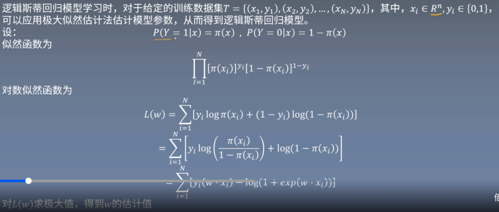

# 这个是重点

## 逻辑斯蒂回归

### 速度快，性能不错
感知机由于sgn函数不可微，则在梯度下降时脱去了sgn函数。

### 逻辑斯蒂公式：
$
\begin{cases}
P(Y = 1|x)=\frac{ e^{\omega\cdot x} }{ 1+e^{\omega\cdot x} }\\
P(Y = 0|x)=\frac{1}{ 1+e^{\omega\cdot x} }\\
\end{cases}
$  
优点：
1) 连续可微
2) P(Y = 1|x)+P(Y = 0|x) = 1,可以表示概率

推导：
  
逻辑斯蒂采用了极大似然估计来估计函数.
训练目标和预测目标达成一致。

## 最大熵：
均匀分布时，熵值最大。  
所以在不知道分布时，默认均匀分布  

### 最大熵模型
目标：求$P(Y|X)$  
优化目标，最大化熵  
$H(P) = -\sum_xP(x)log P(x)$  
$H(P) = -\sum_xP(Y|X)log P(Y|X)$  
调整熵：  
$H(P) = -\sum_x\widehat P(x)P(Y|X)log P(Y|X)$  
其中：$\widehat P(X = x,Y = y)$是训练集中实际情况，可以理解为频率值  
$\widehat P(X = x,Y = y)=\frac{v(X = x,Y = y)}{N}$  
目标（最大化熵）：  
$$max H(P) =-\sum_{x,y}\hat P(x)P(y|x)f(x,y)$$  
约束(s.t)：
$$ E_{\hat P}(f_i) - E_p(f_i) = 0,i = 1, 2, ..., n \\
\sum_y P(y|x) = 1
$$
拉格朗日函数求解