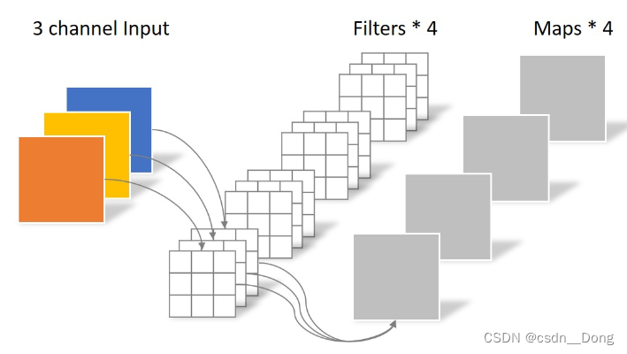

# 可分离卷积（Separable convolution）
包含**空间可分离卷积**，**深度可分离卷积**。  
feature size为[Channel, height, width]
空间指[height, width]
深度是指channel。

## 空间可分离卷积(Spatially Separable Convolutions)
具有以下特点：
* 乘法次数减少
* 计算复杂度降低
* 网络速度更快
将卷积核拆分成小卷积核
例如将3*3卷积核拆分成一个3\*1和一个1\*3的核。
$$
\begin{bmatrix}
3&6&9\\
4&8&12\\
5&10&15\\
\end{bmatrix}=
\begin{bmatrix}
3\\
4\\
5\\
\end{bmatrix}\times 
\begin{bmatrix}
1&2&3
\end{bmatrix}
$$
具体计算流程：

具体乘法计算次数：
卷积：计算次数：9\*9=81  次

深度可分离卷积：计算次数： 15\*3 + 9\*3 = 72

## 深度可分离卷积(depthwise saparable convolution)
分为 depthwise Convlolution、Pointwise Convolution  

#### 常规卷积
参数量：`4*3*3*3`

  
#### Depthwise Convolution(逐深度卷积(滤波))
参数量:`3*3*3`

#### Pointwise Convolution(逐点卷积(组合))
参数量:`1*1*3（inChannel）*4（outChannel）`
Pointwise Convolution的运算与常规卷积运算非常相似，不同之处在于卷积核的尺寸为 1×1
