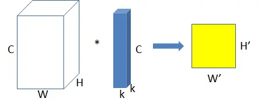
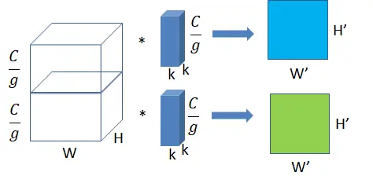

# group convolution 分组卷积
group conv常用在轻量型高效网络中，因为它用少量的参数量和运算量就能生成大量的feature map，大量的feature map意味着能够编码更多的信息！  

## 普通卷积

feature map尺寸：W × H × C
单个卷积核尺寸：k × k × C，输出几个通道需要有几个卷积核
输出feature map尺寸：W' × H'，输出的通道数等于卷积核数量

参数量：k^2^C
运算量FLOPs = k^2^CW'H'

## 分组卷积

将输入的feature mpa分成g组，每个卷积核相应的分为g组，图中g=2，每组卷积都生成也给feature map,最后相比普通卷积，分组卷积在相同计算量的前提下可以生成g倍的feature map。
feature map尺寸：W × H × C/g
单个卷积核尺寸：k × k × C/g
输出feature map尺寸：W' × H'

* 分组卷积矛盾：特征通信
从分组卷积的过程可以看到，分组卷积的特征之间是没有通信的

## 特殊的分组卷积
深度可分离卷积，空间可分离卷积，见[可分离卷积](./1.5可分离卷积.md)