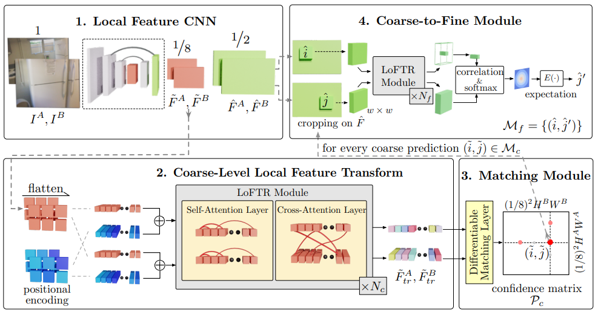
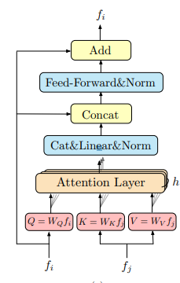
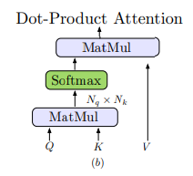

# LoFTR
Local feature TRansformer(LoFTR)  
a novel detector-free approach to local feature matching
一种新颖的无检测器局部特征匹配方法

论文地址：[https://arxiv.org/pdf/2104.00680.pdf](https://arxiv.org/pdf/2104.00680.pdf)

## 摘要
我们建议首先在粗略级（coarse level）别建立像素级密集匹配，然后在精细级(fine level)别细化良好匹配，而不是顺序执行图像特征检测、描述和匹配。
与使用大量成本来搜索对应关系的密集方法相比，我们在 Transformer 中使用自注意力层（self attention）和交叉注意力层(cross attention)来获得以两个图像为条件的特征描述符。Transformer 提供的全局感受野使我们的方法能够在低纹理区域(low-texture areas)产生密集匹配(dense matches)，而特征检测器通常难以产生可重复的兴趣点。--->指的是LoFTR可以自生成关键点

## introduction
给定两个要匹配的图像，大多数现有的匹配方法都包含三个独立的阶段：特征检测（ feature detection）、特征描述（feature description）和特征匹配（feature matching）。

在检测阶段，首先从每幅图像中检测出像角点这样的显着点作为兴趣点。然后在这些兴趣点的邻域区域周围提取局部描述符(local descriptor)。
特征检测和描述阶段产生两组带有描述符的兴趣点，它们的点对点对应关系稍后通过最近邻搜索或更复杂的匹配算法找到。

特征检测器的使用减少了匹配的搜索空间，并且所产生的稀疏对应足以用于大多数任务，例如相机姿态估计.然而，由于纹理差、重复模式、视点变化、光照变化和运动模糊等各种因素，特征检测器可能无法提取图像之间可重复的足够兴趣点.

最近的几项工作试图通过建立像素级密集匹配来解决这个问题。可以从密集匹配中选择具有高置信度分数的匹配，从而避免特征检测。然而，这些作品中由卷积神经网络 (CNN) 提取的密集特征的感受野有限，可能无法区分不明显的区域。人类不仅根据局部邻域，而且根据更大的背景（global context）在这些模糊区域中找到对应关系。特征提取网络中的大感受野是至关重要的。

提出LoFTR，使用具有自注意力层和交叉注意力层的 Transformer来处理（转换）从卷积主干中提取的密集局部特征。首先在低特征分辨率（图像维度的 1/8）的两组变换特征之间提取密集匹配。从这些密集匹配中选择具有高置信度的匹配，然后使用基于相关性的方法将其细化到亚像素级别。Transformer 的全局感受野和位置编码使得转换后的特征表示具有上下文和位置依赖性。通过多次交错自注意力层和交叉注意力层，LoFTR 学习了在地面实况匹配中展示的密集排列的全局一致匹配先验。还采用线性变换器将计算复杂度降低到可管理的水平。

LoFTR 即使在具有低纹理、运动模糊或重复模式的模糊区域也可以产生高质量的匹配。

## Related work
Detector-based Local Feature Matching.基于检测器的局部特征匹配。

我们的工作受到 SuperGlue 的启发，在 GNN 中使用自注意力和交叉注意力在两组描述符之间传递消息，但我们提出了一种无检测器设计来避免特征检测器的缺点。

Detector-free Local Feature Matching.无检测器局部特征匹配。

无检测器方法去除特征检测器阶段并直接产生密集描述符或密集特征匹配.与基于检测器的方法类似，最近邻搜索通常用作匹配密集描述符的后处理步骤。

Transformers in Vision Related Tasks

Recently, Transformers are also getting more attention in computer vision tasks, such as image classification [10], object detection [3] and semantic segmentation [49]

## method
给一个图像I^A^ 和I^B^,现有的局部特征匹配(local feature matching)方法使用一个检测器提取感兴趣区域。我们提出使用detector-free设计来解决特征检测器的可重复性问题。

使用带有FPN的基础CNN结构从图像中提取multi-level特征
使用 $\tilde{F^A}和\tilde{F^B}$ 表示原始图像1/8的粗粒度特征
使用 $\hat{F^A}和\hat{F^B}$ 表示原始图像1/2的细粒度特征

### LoFTR
After the local feature extraction
局部特征提取后,$\tilde{F^A}和\tilde{F^B}$通过 LoFTR 模块来提取位置和上下文相关的局部特征

直观的，LoFTR 模块将特征转换为易于匹配的特征表示。我们将转换后的特征表示(denote)为$\tilde{F^A_{tr}}和\tilde{F^B_{tr}}$.
preliminary: 
#### transformer
一个transformer编码器( transformer encoder)由顺序连接的编码器层(encoder layer)组成。编码器中最重要的元素是transformer层

输入的向量按照惯例就是query、key、value，查询向量 Q 根据 Q 和每个值 V 对应的关键向量 K 的点积计算出的注意力权重，从值向量 V 中检索信息，具体attention层计算过程长这样（下面这个图(B)）

$$
Attention(Q, K, V) = softmax(QK^T)V
$$
注意力操作通过衡量查询元素与每个关键元素之间的相似度来选择相关信息。如果相似度高，则从值向量(value)中提取相关信息。这个过程在图神经网络中也被称为“消息传递”。
#### Linear transformer
将Q、K的长度表示为N，他们特征维度表示为D，Transformer 中 Q 和 K 之间的点积引入的计算成本随着输入序列的长度呈二次方增长 (O(N^2^))。即使局部特征 CNN 减少了输入长度，在局部特征匹配的情况下直接应用 Transformer 的普通版本也是不切实际的。为了解决这个问题，我们建议在 Transformer 中使用一种有效的普通注意力层变体--Linear Transformer,linear transformer主要减少transform的计算复杂度$sim(Q,K) = \phi(Q)\cdot \phi(K)^T$,其中
$\phi(\cdot) = elu(\cdot) + 1$
图3c说明了这个操作

利用矩阵乘积的结合性，可以先进行$\phi(K)^T$ 和V 的乘法运算。因为D << N,所以计算量减少到O（N）。

#### Positional Encoding 位置编码
我们在 DETR [3] 之后使用 Transformers 中标准位置编码的 2D 扩展。与 DETR 不同，我们只将它们添加到骨干输出中一次。我们在补充材料（supplementary material）中保留了位置编码的正式定义。 直观地，位置编码以正弦格式为每个元素提供唯一的位置信息。
通过将位置编码添加到$\tilde{F^A}和\tilde{F^B}$ ，转换后的特征将变得与位置相关，这对于 LoFTR 在不明显区域中产生匹配的能力至关重要。
#### Self-attention and Cross-attention Layers.

self attention中，输入的f~i~和f~j~是一样的。对于cross-attention层，
LoFTR 中可以应用两种类型的可微匹配层，要么使用[37]中的最佳传输（OT）层，要么使用双 softmax 算子.
我们将 LoFTR 模块中的自注意力层和交叉注意力层交错 Nc 次

### 建立粗粒度匹配

LoFTR 中可以应用两种类型的可微匹配层，要么使用[37]中的最佳传输（OT）层（optimal transport layer），要么使用双 softmax 算子
(最后看着好像是OT+双softmax都用到了)
得分矩阵S定义： $S(i, j) = \frac{1}{\tau}\cdot <\tilde{F^A_{tr}(i)}, \tilde{F^B_{tr}(j)}>$

OT层：
-S 可以用作部分分配问题的成本矩阵

双softmax层：

定义了一个置信度矩阵：$\Rho_c$（简单理解，就是一个矩阵两个都进行softmax计算）
$\Rho_c(i,j) = softmax(S(i, \cdot ))_j \cdot softmax(S(\cdot, j))_i $

Match Selection.

基于置信度矩阵 $\Rho_c$，我们选择置信度高于阈值 θc 的匹配，并进一步强制执行相互最近邻（MNN）标准，过滤可能的异常粗略匹配:
$$ \Mu_c = \{(\tilde{i}, \tilde{j})|\forall(\tilde{i}, \tilde{j})\in MNN(\Rho_c),\Rho_c(\tilde{i}, \tilde{j})\ge \theta_c\} $$

### 建立粗到精模块(Coarse-to-Fine)
建立粗略匹配后，使用从粗到细的模块将这些匹配细化为原始图像分辨率.为此，我们使用基于相关性的方法。对于每一个粗粒度下已匹配的$(\tilde{i},\tilde{j})$，我们首先在$\hat{F^A}和\hat{F^B}$上定位其位置，然后裁剪两组大小为$w \times w$的本地窗口.
然后，较小的 LoFTR module将每个窗口内的裁剪特征变换 N~f~ 次，产生两个变换后的局部特征图 $\hat{F^A_{tr}}(\hat{i})和\hat{F^B_{tr}}(\hat{j})$ ，分别以 $\hat{i}$ 和 $\hat{j}$ 为中心。然后，我们将$\hat{F^A_{tr}}(\hat{i})$  的中心向量与 $\hat{F^B_{tr}}(\hat{j})$中的所有向量相关联，从而生成一个热图，表示 $\hat{F^A_{tr}}(\hat{i})和\hat{F^B_{tr}}(\hat{j})$ 邻域中每个像素的匹配概率.
通过计算概率分布的期望，我们得到 I^B^ 上亚像素精度的最终位置 $\hat{j}'$ 。 收集所有匹配项 {($\hat{i}, \hat{j}$)} 产生最终的精细匹配 M~f~

### 3.5 Supervision

最终损失由粗粒度损失和细粒度损失组合而成:
$L = L_c + L_f$

粗粒度的损失函数是最优传输层或双 softmax 算子返回的置信矩阵 Pc 上的负对数似然损失。我们按照 SuperGlue [37] 使用相机姿势和深度图来计算训练期间置信矩阵的地面实况标签。

我们将 ground-truth 粗匹配 M~c~^gt^ 定义为两组 1/8 分辨率网格的相互最近邻居(mutual nearest neighbors)。两个网格之间的距离是通过其中心位置的重投影距离来测量的。